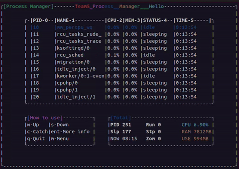

# Process_manager
This is a simple process management application for Linux, developed in Python. It allows users to view, suspend, resume, and terminate processes via a text-based user interface.

## Prerequisites
- Linux operating system
- Python 3.x
- **psutil** library
- Disable Unikey or any input method editor (IME) to avoid unintended behavior when using application.

## Installation
1. Install dependencies:
- pip install psutil
2. Clone the repository:
- git clone https://github.com/TrinhHuuGiang/mini-project-Process_manager.git

## Features
- List all running processes.
- Suspend and resume processes.
- Terminate and kill processes by PID.

